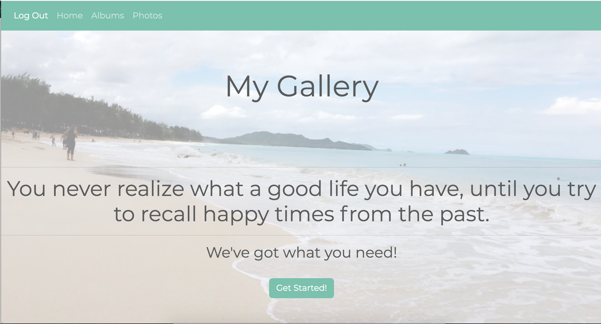

# My Gallery 
This web-development photos gallery is a project for [SEI](https://generalassemb.ly/) course at [Misk academy](https://misk.org.sa/miskacademy/) :camera_flash:
* [Go to the link here](https://my-gallery-ahlam.herokuapp.com/) 

## How To Use: 
The goal of this project is to make it possible for users to have their own photos online and private.
How? First the user should **Sign up** in order to have a private gallery . 

1. Create Albums
2. Add Photos
3. Show All Photos

## Main Technologies:
It is a full stack application using Ruby on Rails and Postgresql.
* [bootstrap](https://github.com/twbs/bootstrap-rubygem)
* [Ruby on Rails](https://rubyonrails.org/)
* [sass-rails](https://github.com/rails/sass-rails)
* [CSS](https://www.w3schools.com/css/)

## Some Features:
* User could search by the name of album.
* User could show all photos togather.
* User could add delete edit albums.

## :soon: Future Improvements:
- [&#x2713;] Upload photos from and to computer.
- [&#x2713;] Have a folder of favorate photos.
- [&#x2713;] Add name to each photo. 
- [&#x2713;] Have multible folders within an album.

### Technical Requirements 

#### Authentication
- User must be able to sign up
- User must be able to sign in
- User must be able to change password
- User must be able to sign out

#### Extra resources (other than User)
- User must be able to create a resource
- User must be able to edit a resource
- User must be able to view all resources they created
- User must be able to view a single resource they created
- User must not be able to edit or delete other users' resources

### Markdown README File
* https://guides.github.com/features/mastering-markdown/
* https://help.github.com/en/articles/basic-writing-and-formatting-syntax#using-emoji

## Useful Resources
- **[Rails Docs](https://guides.rubyonrails.org/getting_started.html)**
- **[Heroku Deployment Rails](https://devcenter.heroku.com/articles/getting-started-with-rails5)**
- **[Git Team Workflow](https://www.atlassian.com/git/tutorials/comparing-workflows)**
- **[Git Team Cheatsheet](https://jameschambers.co/writing/git-team-workflow-cheatsheet/)**
- **[Bootswatch](https://bootswatch.com/)**
